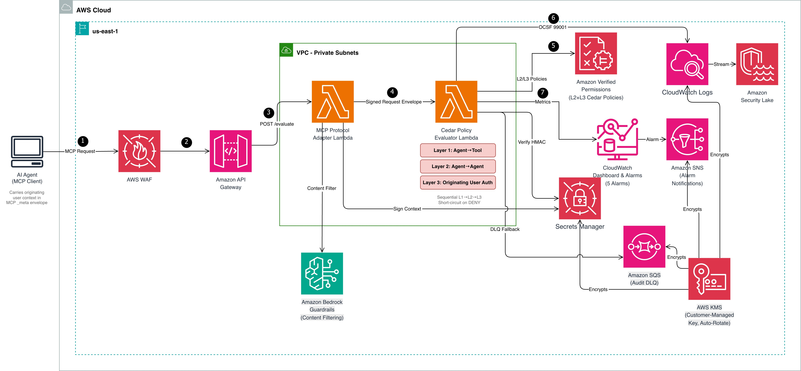

# Enforce least-privilege authorization in multi-agent AI delegation chains using Cedar on AWS

## Introduction

Enforces least-privilege authorization in multi-agent AI delegation chains using [Cedar](https://www.cedarpolicy.com/) policies on AWS. Addresses [OWASP Agentic AI Top 10 AG03](https://genai.owasp.org/resource/owasp-top-10-for-agentic-applications-for-2026/) (Privilege Escalation via Excessive Agency) and aligns with the [NIST AI Agent Standards Initiative](https://www.nist.gov/caisi/ai-agent-standards-initiative) pillars for authorization and access delegation.

When agents delegate tasks to other agents, traditional RBAC only checks the agent's identity — not the human who initiated the request. A low-privilege user can trigger high-privilege operations (record deletion, payment processing) through an agent delegation chain. This system enforces authorization at three layers using Cedar policies, propagates originating user context immutably through delegation hops, and supports OCSF audit event format.

> **Important:** This is a reference implementation providing a starting point for building authorization controls in multi-agent AI systems. Customers are responsible for evaluating, testing, customizing, and maintaining the solution to meet their specific security and compliance requirements.

## Architecture



## Three-Layer Cedar Policy Model

| Layer | Purpose | Example |
|-------|---------|---------|
| L1: Agent-to-Tool | Can this agent invoke this tool? (local cedarpy) | finance-agent can invoke process_payment if trust_level ≥ 3 |
| L2: Agent-to-Agent | Can this agent delegate to that agent? (Amazon Verified Permissions) | orchestrator can delegate to data-bot if depth ≤ 3 |
| L3: Originating User Auth | Does the originating user's role and MFA status authorize this action? (Amazon Verified Permissions) | delete_records requires admin role + MFA |

A request is permitted only if all three layers return PERMIT. Evaluation short-circuits on the first DENY.

## Walkthrough Scenarios

**Scenario A — Privilege Escalation Prevented (DENY):**
Support user → orchestrator → data-bot → delete_records
- L1: PERMIT (agent has capability)
- L2: PERMIT (valid delegation)
- L3: **DENY** (role is "support", not "admin")

**Scenario B — Legitimate Admin (PERMIT):**
Admin user (MFA) → orchestrator → data-bot → delete_records
- L1: PERMIT → L2: PERMIT → L3: **PERMIT**

**Scenario C — Delegation Depth Exceeded (DENY):**
Any user → chain with depth > 5
- L1: PERMIT → L2: **DENY** (hard limit)

## Project Structure

```
cedar-deputy-guard/
├── app.py                          # CDK app entry point (5 stacks)
├── cdk.json                        # CDK context values
├── stacks/
│   ├── kms_stack.py                    # Customer-managed AWS KMS key
│   ├── verified_permissions_stack.py   # Cedar policy store (AVP)
│   ├── lambda_stack.py                 # AWS Lambda, Amazon API Gateway, Amazon VPC, Amazon Cognito
│   ├── security_lake_stack.py          # Audit log group, DLQ
│   ├── monitoring_stack.py             # Dashboard, alarms, Amazon SNS
│   └── pipeline_stack.py              # CI/CD pipelines
├── constructs/
│   ├── cedar_policy_store.py          # AVP policy store construct
│   ├── mcp_adapter_lambda.py          # MCP Adapter Lambda construct
│   ├── cedar_evaluator_lambda.py      # Cedar Evaluator Lambda construct
│   ├── audit_logger.py               # Amazon CloudWatch Logs + Amazon SQS DLQ
│   ├── context_signer.py             # AWS Secrets Manager signing key
│   ├── kms_encryption_key.py         # Customer-managed AWS KMS key construct
│   ├── waf_web_acl.py                # AWS WAF WebACL construct
│   └── cognito_auth.py               # Amazon Cognito User Pool + MFA (construct)
├── lambda/
│   ├── mcp_adapter/
│   │   ├── handler.py                 # MCP Adapter entry point
│   │   ├── mcp_parser.py             # MCP JSON-RPC parsing
│   │   ├── envelope_builder.py       # Request Envelope construction
│   │   ├── context_signer.py         # HMAC-SHA256 signing
│   │   └── guardrails_client.py      # Amazon Bedrock Guardrails integration
│   ├── cedar_evaluator/
│   │   ├── handler.py                 # Cedar Evaluator entry point
│   │   ├── policy_evaluator.py       # L1 local + L2/L3 via AVP
│   │   ├── signature_verifier.py     # HMAC-SHA256 verification
│   │   └── audit_emitter.py          # OCSF event + Amazon CloudWatch metrics
│   └── shared/
│       ├── types.py                   # Pydantic models, dataclasses
│       ├── envelope_schema.py        # JSON schema validation
│       └── ocsf_event_builder.py     # OCSF 99001 event builder
├── cedar/
│   ├── policies/
│   │   ├── layer1-agent-to-tool/     # 6 policies (L1-001 to L1-999)
│   │   ├── layer2-agent-to-agent/    # 5 policies (L2-001 to L2-999)
│   │   └── layer3-originating-user-auth/   # 6 policies (L3-001 to L3-999)
│   └── schema/
│       ├── cedar-entity-schema.json  # AgentAuthz namespace entities
│       └── cedar-context-schema.json # Context attributes
└── tests/
    ├── unit/                          # Unit + CDK snapshot tests
    ├── property/                      # 9 Hypothesis property tests
    ├── integration/                   # Pipeline + scenario tests
    ├── load/                          # Latency + throughput tests
    └── e2e/                           # Live API E2E tests
```

## Prerequisites

- Python 3.12+
- Node.js 20+ (for CDK CLI)
- AWS CDK CLI (`npm install -g aws-cdk`)
- AWS account with CDK bootstrapped (`cdk bootstrap`)
- AWS credentials configured
- An Amazon Bedrock Guardrail ID (create one in the Amazon Bedrock console)

## Setup

```bash
cd cedar-deputy-guard
python3 -m venv .venv
source .venv/bin/activate
```

Install the core dependencies:

```bash
pip install -r requirements.txt
```

Install the development dependencies:

```bash
pip install -r requirements-dev.txt
```

## Running Tests

```bash
# Unit + property + integration + load tests
.venv/bin/python -m pytest tests/ -v

# Cedar policy tests (separate conftest)
.venv/bin/python -m pytest cedar/tests/ -v

# Property tests only (9 correctness properties, 100 iterations each)
.venv/bin/python -m pytest tests/property/ -v

# Load tests only
.venv/bin/python -m pytest tests/load/ -v -s
```

## Deploying

```bash
# Bundle AWS Lambda dependencies (Linux x86_64 wheels)
# Note: activate the venv first, or use .venv/bin/pip directly
source .venv/bin/activate
bash scripts/bundle_lambda.sh

# Deploy all stacks (replace values with your own)
cdk deploy --all --require-approval never \
  -c account_id=YOUR_ACCOUNT_ID \
  -c guardrail_id=YOUR_BEDROCK_GUARDRAIL_ID

# Or deploy individually in order
cdk deploy KmsStack -c account_id=YOUR_ACCOUNT_ID -c guardrail_id=YOUR_GUARDRAIL_ID
cdk deploy VerifiedPermissionsStack -c account_id=YOUR_ACCOUNT_ID -c guardrail_id=YOUR_GUARDRAIL_ID
cdk deploy LambdaStack -c account_id=YOUR_ACCOUNT_ID -c guardrail_id=YOUR_GUARDRAIL_ID
cdk deploy SecurityLakeStack -c account_id=YOUR_ACCOUNT_ID -c guardrail_id=YOUR_GUARDRAIL_ID
cdk deploy MonitoringStack -c account_id=YOUR_ACCOUNT_ID -c guardrail_id=YOUR_GUARDRAIL_ID
```

After deployment completes, verify the stacks are operational:

```bash
# Confirm all stacks deployed successfully
aws cloudformation list-stacks --stack-status-filter CREATE_COMPLETE UPDATE_COMPLETE \
  --query "StackSummaries[?contains(StackName,'Stack')].StackName" --output table

# Note the Amazon API Gateway endpoint from LambdaStack outputs
aws cloudformation describe-stacks --stack-name LambdaStack \
  --query "Stacks[0].Outputs[?OutputKey=='ApiEndpoint'].OutputValue" --output text
```

## E2E Testing (against deployed API)

```bash
# Set the API endpoint from the LambdaStack output
export API_ENDPOINT=$(aws cloudformation describe-stacks --stack-name LambdaStack \
  --query "Stacks[0].Outputs[?OutputKey=='ApiEndpoint'].OutputValue" --output text)

# Run E2E tests against the live API
.venv/bin/python -m pytest tests/e2e/ -v -s
```

## Cleanup

> **Cost Notice:** This solution deploys billable AWS resources including a NAT gateway (~$0.045/hour), AWS Lambda functions, Amazon API Gateway, AWS KMS keys, and other services. Charges accrue while resources are deployed. Follow the cleanup steps in the following section after testing to avoid ongoing costs.

> ⚠️ **Warning:** The following commands permanently delete all deployed resources and data (audit logs, Cedar policies, secrets). This action cannot be undone.

```bash
# Destroy stacks in reverse dependency order (takes 5-10 minutes)
cdk destroy MonitoringStack SecurityLakeStack --force \
  -c account_id=YOUR_ACCOUNT_ID -c guardrail_id=YOUR_GUARDRAIL_ID
cdk destroy LambdaStack --force \
  -c account_id=YOUR_ACCOUNT_ID -c guardrail_id=YOUR_GUARDRAIL_ID
cdk destroy VerifiedPermissionsStack --force \
  -c account_id=YOUR_ACCOUNT_ID -c guardrail_id=YOUR_GUARDRAIL_ID
cdk destroy KmsStack --force \
  -c account_id=YOUR_ACCOUNT_ID -c guardrail_id=YOUR_GUARDRAIL_ID

# Delete retained log groups (RETAIN removal policy prevents automatic deletion)
aws logs delete-log-group --log-group-name /cedar-evaluator/audit
aws logs delete-log-group --log-group-name /cedar-evaluator/api-access

# Delete retained AWS Secrets Manager secret (may be retained for recovery after stack deletion)
aws secretsmanager delete-secret --secret-id agent-authz/signing-key \
  --force-delete-without-recovery
```

Verify cleanup completed:

```bash
cdk list  # Should return no stacks
aws logs describe-log-groups --log-group-name-prefix /cedar-evaluator/ \
  --query "logGroups[*].logGroupName" --output text
# Should return empty
```

## Correctness Properties

The system validates 9 formal correctness properties using Hypothesis property-based testing:

| # | Property | Validates |
|---|----------|-----------|
| 1 | L1 agent-to-tool policy correctness | Req 1.1 |
| 2 | L2 delegation policy correctness | Req 1.2 |
| 3 | L3 originating user authorization correctness | Req 1.3 |
| 4 | Three-layer conjunction with deny identification | Req 1.4, 1.5 |
| 5 | User context extraction completeness | Req 2.1 |
| 6 | HMAC-SHA256 signing round trip + tamper detection | Req 2.3, 2.4 |
| 7 | Delegation depth increment invariant | Req 2.5 |
| 8 | OCSF audit event completeness | Req 4.1, 4.2 |
| 9 | MCP parsing produces valid envelope | Req 5.2 |

## AWS Resources Created

| Stack | Resources |
|-------|-----------|
| KmsStack | Customer-managed AWS KMS key with auto-rotation, alias, service principal grants |
| VerifiedPermissionsStack | Cedar policy store, 8 policies (L2 + L3), entity schema |
| LambdaStack | Amazon VPC, 2 AWS Lambda functions, Amazon API Gateway, AWS Secrets Manager secret (AWS KMS-encrypted), AWS WAF WebACL, Amazon Cognito User Pool (TOTP MFA), Amazon DynamoDB rate-limit table (AWS KMS-encrypted), SSM Parameter (enforcement mode) |
| SecurityLakeStack | Amazon CloudWatch Logs group (AWS KMS-encrypted), Amazon SQS dead-letter queue (AWS KMS-encrypted) |
| MonitoringStack | Amazon CloudWatch dashboard, 5 alarms, Amazon SNS topic (AWS KMS-encrypted) |

## Security Hardening

- **AWS KMS:** Customer-managed key with auto-rotation encrypts AWS Secrets Manager, Amazon CloudWatch Logs, Amazon SQS DLQ, and Amazon SNS
- **AWS WAF:** WebACL with CommonRuleSet, SQLiRuleSet, rate limiting (100 req/5min), and body size constraint (8KB)
- **Amazon Cognito:** User Pool with TOTP MFA required, strict password policy, for human operator authentication
- **Amazon VPC isolation:** Both AWS Lambda functions run in private subnets with NAT gateway (no public internet ingress)
- **HMAC integrity:** Originating user context signed with HMAC-SHA256; verifier supports key rotation with 24-hour grace period

## Operational Features

- **Gradual rollout (enforcement mode):** Switch between ENFORCE, LOG_ONLY (shadow mode), and WARN via SSM Parameter Store without redeployment. LOG_ONLY evaluates policies but always returns PERMIT, logging what would have been denied. Change takes effect within 30 seconds.
  ```bash
  aws ssm put-parameter --name "/cedar-authz/enforcement-mode" --value "LOG_ONLY" --type String --overwrite
  ```
- **Risk-aware tool entities:** Tool registry (`lambda/cedar_evaluator/tool_registry.py`) maps each tool to its risk_level and data_classification. Unknown tools default to high-risk. Cedar L1 policies can differentiate authorization based on tool risk.
- **Rate limiting:** DynamoDB-backed temporal constraints checked before Cedar evaluation. Configurable per-user/session limits (e.g., max 5 refunds/hour, max 3 deletes/day). Fails open on DynamoDB errors to avoid blocking legitimate traffic.

## NIST SP 800-53 Compliance

| Control | Implementation |
|---------|---------------|
| AC-4 | User context flows immutably through delegation chain via HMAC-signed envelopes |
| AC-6 | Dual authorization: agent capability (L1) AND user role (L3) |
| AC-6(1) | MFA required for high-risk tool invocations (L3 Cedar policies) |
| AC-6(5) | Destructive operations restricted to admin + MFA |
| AU-2 | Every policy evaluation logged as OCSF 99001 |
| AU-3 | Logs include user identity, delegation chain, action, resource, per-layer decisions, latency |
| SI-10 | HMAC verified before evaluation; Amazon Bedrock Guardrails on inbound |
| IA-2(1) | Amazon Cognito User Pool with TOTP MFA for human operator authentication |
| SC-12 | AWS KMS customer-managed key with automatic rotation; signing key in AWS Secrets Manager |
| SC-28 | AWS KMS encryption at rest for AWS Secrets Manager, Amazon CloudWatch Logs, Amazon SQS DLQ, Amazon SNS |

## Conclusion

This reference implementation demonstrates how to enforce least-privilege authorization in multi-agent AI delegation chains using a three-layer Cedar policy model on AWS. By combining agent capability checks (L1), delegation path constraints (L2), and originating user authorization (L3), the system prevents privilege escalation through agent delegation chains. The reference implementation models sequential delegation chains; parallel (diamond) delegation patterns require extending the envelope schema to support branching. Deploy this implementation to your AWS account and customize the Cedar policies to match your agent delegation requirements. For more information, see the [Cedar policy language documentation](https://docs.cedarpolicy.com/) and the [Amazon Verified Permissions User Guide](https://docs.aws.amazon.com/verifiedpermissions/latest/userguide/).

For production deployments, consider extending this pattern with:

- **Human-in-the-loop escalation** — Convert borderline denials into approval workflows rather than hard blocks
- **Multi-tenant isolation** — Add tenant context to Cedar policies to prevent cross-tenant access through delegation chains
- **Dynamic policy hot-reload** — Use S3-backed policy loading for L1 to enable emergency tool shutdowns without redeployment

## License

This project is provided as a reference implementation for the blog post
"Enforce least-privilege authorization in multi-agent AI delegation chains using Cedar on AWS".

MIT-0 License. See [LICENSE](LICENSE).
